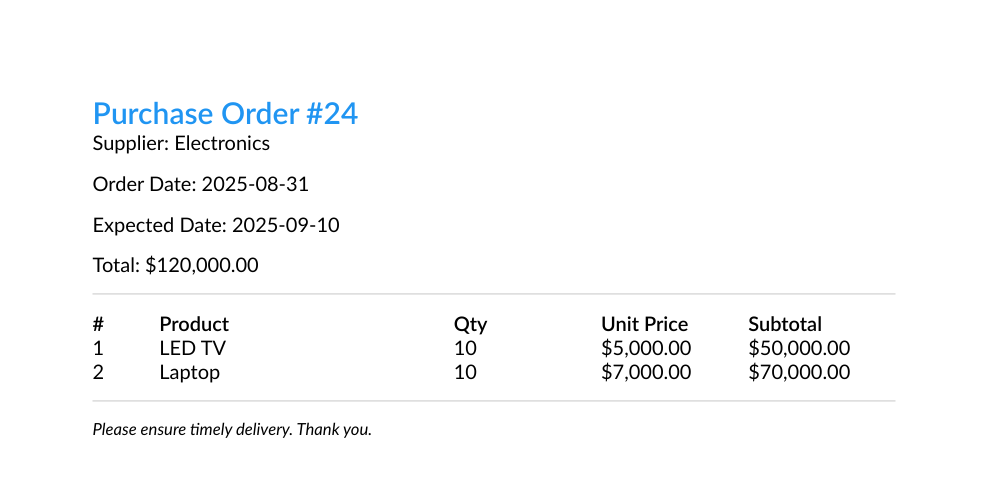
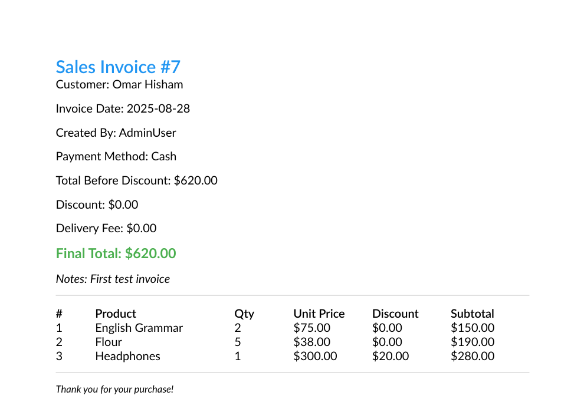
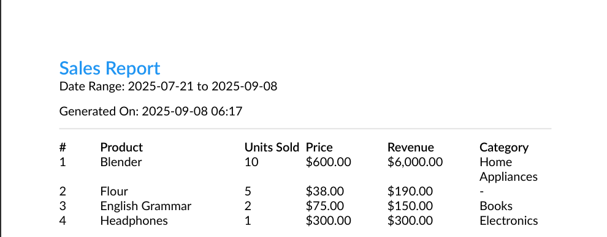

# -Inventory_System
 Inventory &amp; Order Management System built with ASP.NET Core &amp; Clean Architecture. Features include role-based authentication, product &amp; category management, purchase orders, sales invoicing, real-time stock control, PDF export, notifications, and reporting.

 Designed for **scalability**, **testability**, and **real-world business workflows** such as product tracking, sales invoicing, stock adjustment, and purchase order lifecycle handling — including **Domain Events**, **Background Services**, and **Real-Time Notifications using SignalR**.

📄 **API Documentation:** [View PDF](docs/API_Documentation.pdf)

---

## ⚙️ Requirements & Setup (Without Docker)

### ✅ Requirements
Make sure you have installed:

- [.NET 8 SDK](https://dotnet.microsoft.com/en-us/download)
- [SQL Server](https://www.microsoft.com/en-us/sql-server/sql-server-downloads) (LocalDB or full instance)
- [Visual Studio 2022](https://visualstudio.microsoft.com/vs/) **or** [Visual Studio Code](https://code.visualstudio.com/)


### 🚀 Setup Steps

#### 1. Clone the repository
```bash
git clone https://github.com/your-username/Inventory_System.git
cd Inventory_System
```

#### 2.Configure appsettings.json
In src/InventorySystem.Api/appsettings.json, update the configuration:
```bash
{
  "ConnectionStrings": {
    "DefaultConnection": "Server=YOUR_SQL_SERVER;Database=InventorySystem;Trusted_Connection=True;TrustServerCertificate=True;MultipleActiveResultSets=True"
  },

  "JwtOptions": {
    "Issuer": "your-app",
    "Audience": "your-app-users",
    "SecretKey": "your-super-secret-key"
  },

  "SmtpOptions": {
    "Host": "smtp.yourmail.com",
    "Port": 587,
    "UserName": "your-email@domain.com",
    "Password": "your-email-password",
    "EnableSsl": true
  },

  "LinkOptions": {
    "BaseUrl": "http://localhost:4200"
  }
}

```
#### 3. Apply EF Core migrations
 ```bash
dotnet ef database update --project src/InventorySystem.Infrastructure --startup-project src/InventorySystem.Api
```

##### 4. Run the API
  ```bash
cd src/InventorySystem.Api
dotnet run
```


---

## 🖥️ API Endpoints & Test Account

You can explore all API endpoints using **Swagger**:  
[Swagger UI](http://smartinventory.runasp.net)

### Test Account
Use the following credentials to test authentication and API calls:

- **Email:** `Admin@Gmail.com`  
- **Password:** `Admin#123`
- **DeviceId:** `A1`

---

## 📂 Project Structure

src/
├── InventorySystem.Api           # Presentation layer (controllers, middlewares, config)
├── InventorySystem.Application   # CQRS commands, queries, DTOs, validators
├── InventorySystem.Domain        # Entities, Enums, Domain Events
├── InventorySystem.Infrastructure# EF Core, Repositories, Identity, Services
└── Shared                        # Shared DTOs, constants, error models


---

 ## 🏗️ Architecture Highlights
- ✅ **Clean Architecture** (Domain, Application, Infrastructure, WebAPI)
- ✅ **CQRS** with MediatR for commands and queries
- ✅ **Domain Events** for triggering side effects like:
  - 📧 Sending emails when a Purchase Order is Created, Received, or Cancelled
  - 🔔 Sending real-time SignalR notifications
  - 📉 Automatically checking for low-stock products after stock adjustments
- ✅ **SignalR** for real-time notifications (e.g., low stock alerts, PO updates)
- ✅ **Background Services** for deferred or long-running domain operations
- ✅ SQL atomic updates to guarantee stock integrity at the database level.
- ✅ **Role-based Authorization** (Admin, Manager, Sales, Warehouse)
- ✅ **Soft Deletion**, Optimistic Concurrency, FluentValidation pipeline
- ✅ Applied the Observer pattern with Domain Events, SignalR, and Background Services to decouple workflows (e.g., triggering real-time notifications and emails when purchase orders are created or updated).


## 🔥 Key Features

- 🔐 **Authentication & Refresh Tokens**
- 🧾 **Sales Invoicing**
- 📦 **Inventory Control** with value reports & manual adjustments
- 🛒 **Purchase Orders** (create, cancel, receive, export to PDF)
- 🧍 **Employee, Customer & Supplier Management**
- 📊 **Sales Reports** + PDF export
- 🔔 **Real-time Notifications with SignalR**
- 📃 **Stock Adjustment Logs** + PDF export

## 📬 Notable Domain Events

- 🟡 `PurchaseOrderStatusChangedDomainEvent`:  
  - Sends SignalR notifications to warehouse users  
  - Emails supplier with the order details

- 🔴 `ProductStockDecreasedDomainEvent`:  
  - Automatically triggers low stock warning  
  - Sends SignalR notification to managers

---

## 🧠 How CQRS Works Here

- Commands → Handlers → Services for business logic
- Queries → Handlers for read-only views
- MediatR decouples the flow
- Validators run in the pipeline before command handlers

---

### PDF Previews

**Purchase Order PDF:**


**Sales Invoice PDF:**


**Sales Report PDF:**



---

## 📡 Real-Time with SignalR

- `NotificationHub` broadcasts:
  - 🔔 New domain event-based notifications
  - 📉 Low-stock warnings
  - ✅ Purchase order status updates
